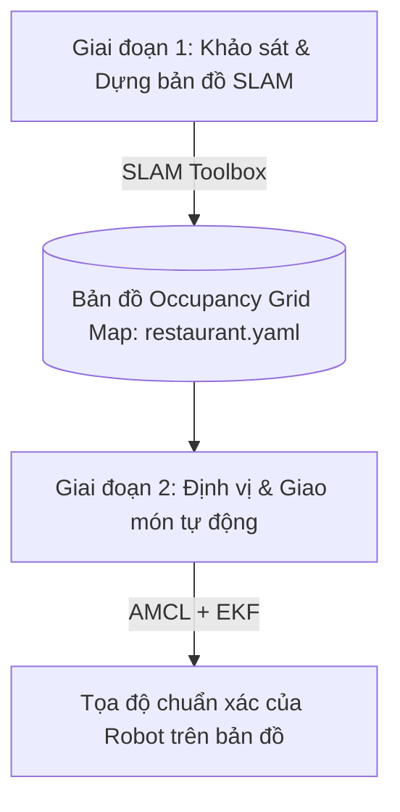
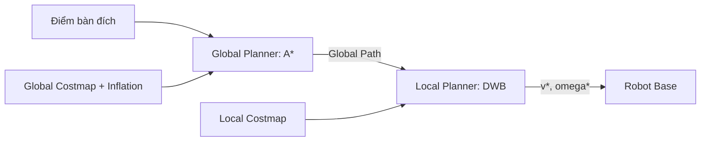
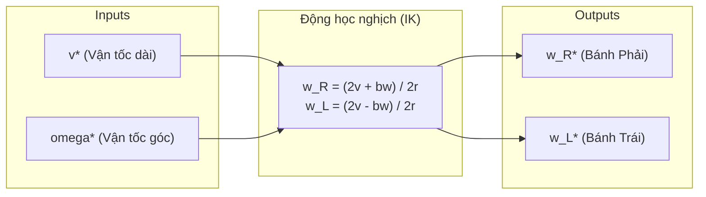

# Thiết Kế Phương Pháp & Giải Thuật Điều Khiển Robot Phục Vụ Thức Ăn (AMR)

> **Dự án:** Robot Tự Hành Vận Chuyển Thức Ăn Trong Nhà Hàng (Food Delivery AMR)  
> **Nền tảng:** ROS 2 Jazzy (Ubuntu 24.04 LTS) | Trình mô phỏng: Gazebo Harmonic  
> **Cấu hình phần cứng mô phỏng:** Thực thi toàn bộ trên 1 máy tính duy nhất (Single-PC Simulation)  
> **Cơ cấu truyền động:** 2 bánh dẫn động vi sai chủ động + 4 bánh caster bị động (Phi Holonomic)  
> **Tài liệu đối chiếu:** Cơ sở lý thuyết Chương 2 & Thiết kế giải thuật Chương 5  

---

## 1. Kiến Trúc Điều Khiển Phân Tầng Hệ Thống (System Control Architecture)

Toàn bộ hệ thống điều khiển được xây dựng theo kiến trúc phân tầng hoạt động trên nền tảng **ROS 2** thông qua cơ chế Node giao tiếp bằng Publisher-Subscriber và Service/Action:

```mermaid
graph TD
    subgraph HighLevel ["Tầng Điều Khiển Cấp Cao (ROS 2 / Navigation Stack)"]
        Nav2Goal[Điểm Bàn Ăn / Trạm Bếp (Goal)] --> GlobalPlanner[Hoạch định toàn cục: A* Planner]
        GlobalPlanner -->|Global Path| DWB[Điều hướng cục bộ: DWB Controller]
        Costmaps[Costmap 2D: Static + Inflation + Obstacle] --> GlobalPlanner
        Costmaps --> DWB
        DWB -->|Lệnh vận tốc v*, omega*| CmdVelTopic[/cmd_vel/]
    end

    subgraph StateEstimation ["Tầng Định Vị & Dựng Bản Đồ (SLAM & EKF)"]
        LiDAR[/scan - LiDAR 2D/] --> SLAM[SLAM Toolbox / AMCL]
        SLAM -->|Tọa độ toàn cục & TF: map -> odom| Costmaps
        
        WheelOdom[/wheel/odom - Encoder vi sai/] --> EKF[Bộ lọc Extended Kalman Filter]
        IMU[/imu/data - Cảm biến IMU 9-DOF/] --> EKF
        EKF -->|/odometry/filtered & TF: odom -> base_footprint| DWB
        EKF --> SLAM
    end

    subgraph SimulationExecution ["Tầng Chấp Hành Mô Phỏng (Gazebo Harmonic - Single PC)"]
        CmdVelTopic --> DiffDrivePlugin[Gazebo Diff-Drive System Plugin]
        DiffDrivePlugin -->|Động học nghịch & Điều khiển mô-men| WheelJoints[Khớp bánh xe chủ động Trái / Phải]
        WheelJoints -->|Encoder feedback| WheelOdom
        GazeboPhysics[Gazebo Physics Engine] --> IMU
    end
```

### Phân công trách nhiệm các tầng trong mô phỏng (Single-PC):
1. **Tầng Cấp cao (High-Level Controller - ROS 2):**
   - Thu nhận chùm tia quét từ LiDAR 2D (`/scan`).
   - Xử lý dữ liệu định vị toàn cục (AMCL) và dựng bản đồ (SLAM Toolbox).
   - Hoạch định quỹ đạo toàn cục ngắn nhất bằng giải thuật $A^*$.
   - Tính toán cửa sổ vận tốc động và tránh vật cản tức thời bằng bộ điều khiển DWB.
2. **Tầng Ước lượng trạng thái (State Estimation - EKF):**
   - Hợp nhất dữ liệu vận tốc bánh xe (`/wheel/odom`) và quán tính (`/imu/data`) thông qua EKF để loại bỏ trôi dạt (drift).
3. **Tầng Chấp hành mô phỏng (Actuator & Low-Level Simulation):**
   - Thay vì cần vi điều khiển STM32 và Driver BLDC vật lý, trình mô phỏng Gazebo Harmonic sử dụng plugin `gz-sim-diff-drive-system` (hoặc `ros2_control`). Plugin này tự động giải bài toán động học nghịch, đóng vai trò như bộ điều khiển PID vận tốc vòng kín và mô phỏng phản hồi encoder bánh xe.

---

## 2. Ước Lượng Trạng Thái & Hợp Nhất Dữ Liệu Cảm Biến (EKF)

Để khắc phục sai số trượt bánh tích lũy của Encoder và sai số trôi (drift) theo thời gian của con quay hồi chuyển IMU, hệ thống áp dụng thuật toán **Extended Kalman Filter (EKF)** theo chu trình lặp 2 giai đoạn:


### 2.1. Giai đoạn Dự đoán (Prediction)
* **Vector trạng thái xe trong mặt phẳng 2D:**
  $$x_k = \begin{bmatrix} x_k \\ y_k \\ \psi_k \end{bmatrix}$$
* **Vector điều khiển đầu vào từ động học vi sai:**
  $$u_k = \begin{bmatrix} v_k \\ \omega_k \end{bmatrix}$$
* **Mô hình trạng thái phi tuyến rời rạc với chu kỳ lấy mẫu $\Delta t$:**
  $$\hat{x}_k^- = f(\hat{x}_{k-1}, u_k) = \begin{bmatrix} \hat{x}_{k-1} + v_k \cos(\hat{\psi}_{k-1}) \Delta t \\ \hat{y}_{k-1} + v_k \sin(\hat{\psi}_{k-1}) \Delta t \\ \hat{\psi}_{k-1} + \omega_k \Delta t \end{bmatrix}$$
* **Tuyến tính hóa qua ma trận Jacobian $F_k$:**
  $$F_k = \left. \frac{\partial f}{\partial x} \right|_{\hat{x}_{k-1}, u_k} = \begin{bmatrix} 1 & 0 & -v_k \sin(\hat{\psi}_{k-1}) \Delta t \\ 0 & 1 & v_k \cos(\hat{\psi}_{k-1}) \Delta t \\ 0 & 0 & 1 \end{bmatrix}$$
* **Dự đoán hiệp phương sai sai số:**
  $$P_k^- = F_k P_{k-1} F_k^T + Q_k$$
  *(Trong đó $Q_k$ là ma trận hiệp phương sai của nhiễu quá trình, đặc trưng cho mức độ bất định của mô hình động học).*

### 2.2. Giai đoạn Cập nhật hiệu chỉnh (Update)
* Khi nhận được vector đo lường $z_k$ từ cảm biến (vận tốc dài/góc từ Encoder và vận tốc góc/góc hướng từ IMU):
  * **Tuyến tính hóa mô hình đo:**
    $$H_k = \left. \frac{\partial h}{\partial x} \right|_{\hat{x}_k^-}$$
  * **Tính ma trận độ lợi Kalman (Kalman Gain):**
    $$K_k = P_k^- H_k^T (H_k P_k^- H_k^T + R_k)^{-1}$$
  * **Hiệu chỉnh trạng thái ước lượng:**
    $$\hat{x}_k = \hat{x}_k^- + K_k \left(z_k - h(\hat{x}_k^-)\right)$$
  * **Cập nhật ma trận hiệp phương sai:**
    $$P_k = (I - K_k H_k) P_k^-$$
  *(Trong đó $R_k$ là ma trận hiệp phương sai của nhiễu đo lường, được xác định dựa trên thông số sai số của cảm biến).*

---

## 3. Thuật Toán Dựng Bản Đồ & Định Vị (SLAM & AMCL)



### 3.1. Dựng bản đồ (SLAM): SLAM Toolbox
* **Biểu diễn môi trường (Occupancy Grid Map):**
  * Kích thước ô lưới: $0.05 \times 0.05\text{ m}$ ($5\text{ cm}$/pixel).
  * Trạng thái nhị phân xác suất log-odds:
    * **0 (Trống - Free):** Vùng an toàn để di chuyển.
    * **100 (Chiếm chỗ - Occupied):** Vật cản tĩnh (tường nhà hàng, chân bàn, chân ghế).
    * **-1 (Chưa xác định - Unknown):** Vùng khuất hoặc ngoài tầm quét của LiDAR ($> 12\text{ m}$).
* **Cơ chế Local Scan Matching:**
  * Sử dụng thuật toán tối ưu hóa phi tuyến (Ceres Solver) đối sánh đám mây tia LiDAR hiện thời với các khung quét lân cận, xác định bước dịch chuyển tức thời với độ chính xác cao.
* **Cơ chế Loop Closure & Graph Optimization:**
  * Khi robot tuần tra hết một vòng nhà hàng và quay lại khu vực bếp, thuật toán nhận diện nút mạng lặp, tối ưu đồ thị pose-graph để triệt tiêu hiện tượng méo bản đồ.

### 3.2. Định vị trên bản đồ đã dựng: AMCL (Adaptive Monte Carlo Localization)
* **Khởi tạo tập hạt (Particle Filter):** Phân bổ $50 - 500$ hạt đại diện cho phân bố xác suất vị trí và góc hướng $(x, y, \psi)$ của robot.
* **Cập nhật chuyển động:** Dịch chuyển các hạt dựa trên dữ liệu Odometry từ bộ lọc EKF.
* **Cập nhật đo lường:** Đối chiếu chùm tia quét thực tế của LiDAR với bản đồ tĩnh, gán trọng số xác suất cao cho các hạt khớp với môi trường chân bàn ghế và tường.
* **Lấy mẫu lại (Resampling):** Loại bỏ các hạt trọng số thấp, hội tụ các hạt quanh vị trí thực tế, đưa sai số định vị về mức nhỏ hơn $\pm 10\text{ mm}$.

---

## 4. Hoạch Định Đường Đi (Path Planning - Nav2)



### 4.1. Hoạch định toàn cục (Global Planning): Thuật toán $A^*$
* **Cơ chế Costmap & Lạm phát (Inflation Radius):**
  * Bản đồ chi phí lạm phát suy giảm hàm mũ từ tâm vật cản ra ngoài:
    $$\text{cost}(d) = 253 \cdot e^{-\alpha(d - r_{nt})}$$
  * Quy luật này ép robot luôn chọn quỹ đạo nằm ở chính giữa lối đi ($2.4\text{m}$), cách xa mép tường và 4 chân bàn ghế.
* **Hàm mục tiêu tìm kiếm trên lưới 8 hướng:**
  $$f(n) = g(n) + h(n)$$
  * $g(n)$: Chi phí thực tế đã tích lũy từ điểm xuất phát đến nút $n$.
  * $h(n) = \sqrt{(x_{goal} - x_n)^2 + (y_{goal} - y_n)^2}$: Hàm Heuristic tính khoảng cách Euclid từ nút $n$ đến điểm đích.
* **Kết quả:** Xuất ra tập các điểm mốc (Waypoints) ngắn nhất và an toàn nhất từ trạm bếp đến bàn ăn.

### 4.2. Điều hướng cục bộ & Tránh vật cản (Local Planning): Thuật toán DWB
* **Xác định Cửa sổ động (Dynamic Window - $V$):**
  Thu hẹp không gian tìm kiếm vận tốc thành giao điểm của 3 tập hợp ràng buộc:
  $$V = V_m \cap V_d \cap V_a$$
  * $V_m$: Giới hạn vận tốc cơ khí tối đa của hệ thống dẫn động ($v \le 0.8\text{ m/s}, |\omega| \le 1.0\text{ rad/s}$).
  * $V_d$: Giới hạn gia tốc tăng/giảm tốc cho phép (tránh rung lắc gây đổ thức ăn, nước uống):
    $$V_d = \left\{ (v, \omega) \mid v_{k-1} - a_{dec} \Delta t \le v \le v_{k-1} + a_{acc} \Delta t \right\}$$
  * $V_a$: Giới hạn vận tốc dừng an toàn (đảm bảo quãng đường phanh dừng hẳn trước vật cản bất ngờ).
* **Mô phỏng & Đánh giá quỹ đạo (Critics Scoring):**
  Mô phỏng quỹ đạo ngắn hạn trong khoảng thời gian $T_{sim} = 1.5 - 2.0\text{ s}$ cho các cặp vận tốc $(v, \omega)$ và tính tổng chi phí:
  $$\text{cost}(v, \omega) = \sum_{k} w_k \cdot \text{Critic}_k(v, \omega)$$
  * **`PathAlignCritic`:** Ép robot bám sát quỹ đạo toàn cục của $A^*$.
  * **`BaseObstacleCritic`:** Phạt nặng hoặc loại bỏ ngay quỹ đạo cắt qua chân bàn, chân ghế hoặc người đi lại.
  * **`OscillationCritic`:** Triệt tiêu hiện tượng robot đảo chiều liên tục (chống rung lắc thân xe trong lối hẹp).
  * **`GoalAlignCritic` & `GoalDistCritic`:** Đưa xe tiến dần về bàn ăn và tự động định hướng vuông góc với vị trí bàn giao thức ăn.
* **Lựa chọn:** Chọn cặp vận tốc $(v^*, \omega^*)$ có chi phí nhỏ nhất để gửi xuống bộ điều khiển.

---

## 5. Mô Hình Động Học Hệ Vi Sai (Differential Drive Kinematics)

Robot sử dụng 2 bánh dẫn động vi sai ở giữa kết hợp 4 bánh caster bị động tự do ở 4 góc, tuân thủ ràng buộc phi Holonomic (lăn thuần túy, không trượt ngang).



### 5.1. Thông số hình học từ mô hình CAD / URDF
* Bán kính bánh dẫn động: $r = 0.075\text{ m}$ (Đường kính $150\text{ mm}$).
* Khoảng cách giữa 2 bánh dẫn động (Bề rộng cơ sở): $b = 0.500\text{ m}$ ($500\text{ mm}$).
* Vận tốc góc bánh trái, bánh phải: $\omega_L, \omega_R$ ($\text{rad/s}$).

### 5.2. Bài toán Động học thuận (Forward Kinematics)
Tính toán vận tốc dài $v$ và vận tốc góc $\omega$ của robot phục vụ bài toán Odometry:
$$\begin{cases} v = \dfrac{r}{2} (\omega_R + \omega_L) \\ \omega = \dfrac{r}{b} (\omega_R - \omega_L) \end{cases}$$

Chuyển đổi sang hệ quy chiếu toàn cục:
$$\begin{bmatrix} \dot{x}_M \\ \dot{y}_M \\ \dot{\psi} \end{bmatrix} = \begin{bmatrix} \dfrac{r}{2} \cos(\psi) & \dfrac{r}{2} \cos(\psi) \\ \dfrac{r}{2} \sin(\psi) & \dfrac{r}{2} \sin(\psi) \\ \dfrac{r}{b} & -\dfrac{r}{b} \end{bmatrix} \begin{bmatrix} \omega_R \\ \omega_L \end{bmatrix}$$

### 5.3. Bài toán Động học nghịch (Inverse Kinematics)
Quy đổi lệnh vận tốc tối ưu $(v^*, \omega^*)$ từ DWB Controller thành vận tốc góc đặt cho từng bánh xe:
$$\begin{cases} \omega_R^* = \dfrac{2v^* + b\omega^*}{2r} = \dfrac{v^* + 0.25 \omega^*}{0.075} \\ \omega_L^* = \dfrac{2v^* - b\omega^*}{2r} = \dfrac{v^* - 0.25 \omega^*}{0.075} \end{cases}$$

---

## 6. Bảng Ánh Xạ Giữa Lý Thuyết & Triển Khai Mô Phỏng Trên 1 PC

| Khái niệm Lý thuyết | Thành phần thực tế | Thành phần tương đương trong Mô phỏng (Single PC) | Topic / Cấu hình ROS 2 |
| :--- | :--- | :--- | :--- |
| **Động học nghịch** | STM32 / Driver BLDC | Plugin `gz-sim-diff-drive-system` | Đọc `/cmd_vel`, điều khiển khớp bánh |
| **Encoder phản hồi** | Cảm biến từ / Quang | Gazebo Joint State Sensor | Xuất `/joint_states`, `/wheel/odom` |
| **Cảm biến quán tính** | Module IMU 9-DOF | Plugin `gz-sim-imu-system` | Xuất `/imu/data` |
| **Bộ lọc EKF** | Thuật toán EKF trên MCU/Jetson | Package `robot_localization` (`ekf_node`) | Hợp nhất `/wheel/odom` + `/imu/data` $\to$ `/odometry/filtered` |
| **Dựng bản đồ** | SLAM trên Jetson Orin | Package `slam_toolbox` (async_slam) | Đọc `/scan` + TF, tạo bản đồ Occupancy Grid |
| **Định vị toàn cục** | Thuật toán Monte Carlo | Package `nav2_amcl` | Định vị hạt xác suất trên bản đồ tĩnh |
| **Quy hoạch toàn cục** | Giải thuật $A^*$ | Nav2 `nav2_navfn_planner` / Smac Planner | Global Costmap $\to$ Global Plan |
| **Điều hướng cục bộ** | Cửa sổ động DWB | Nav2 `dwb_core::DWBLocalPlanner` | Local Costmap $\to$ Lệnh `/cmd_vel` |
| **Bảo vệ đồ ăn / Nước** | Giới hạn gia tốc & Jerk | Tham số gia tốc trong DWB Controller & Costmap | Giới hạn $a_c \le 0.4\text{ m/s}^2, a \le 0.4\text{ m/s}^2$ |
