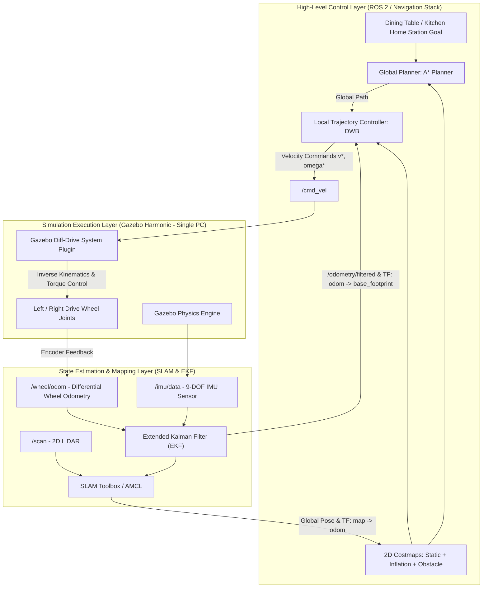
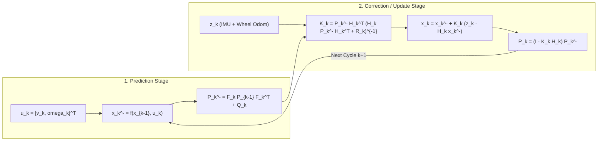
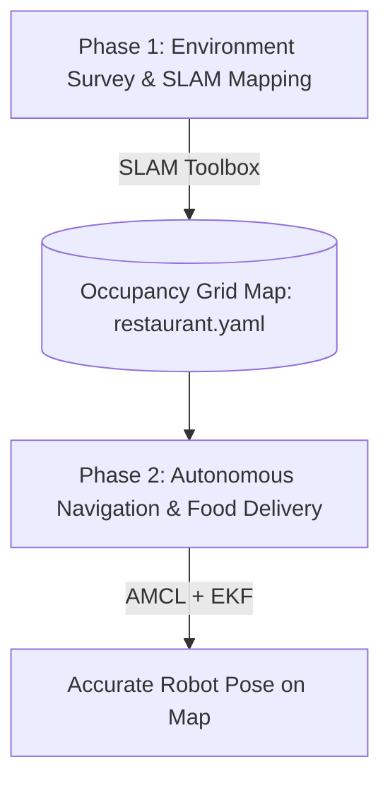
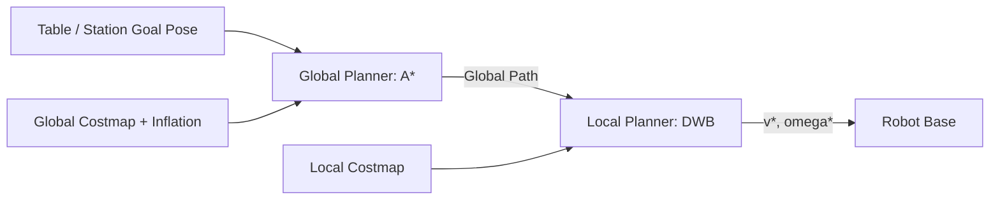
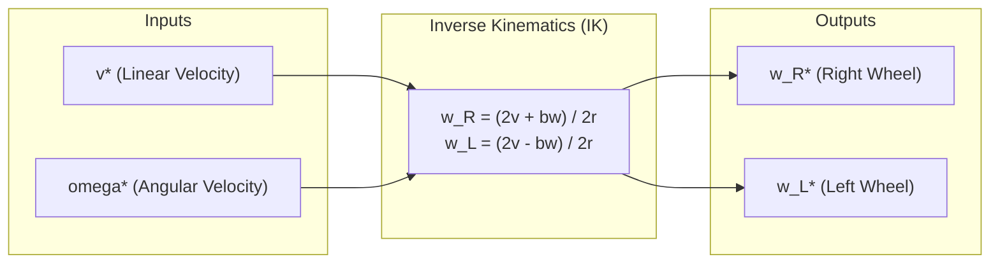

# Control Methodology & Algorithm Design for Food Delivery Autonomous Mobile Robot (AMR)

> **Project:** Autonomous Mobile Robot (AMR) for Restaurant Food Delivery  
> **Platform:** ROS 2 Jazzy (Ubuntu 24.04 LTS) | Simulation Engine: Gazebo Harmonic  
> **Simulation Architecture:** Single-PC Simulation Execution  
> **Mobility Mechanism:** 2 Active Differential Drive Wheels + 4 Passive Caster Wheels (Non-Holonomic)  
> **Reference Documentation:** Theoretical Foundations (Chapter 2) & Algorithm Design (Chapter 5)  

---

## 1. Hierarchical System Control Architecture

The overall control architecture is designed with a hierarchical structure executing on the **ROS 2** framework via Node communication using Publishers, Subscribers, Services, and Actions:

### Layer Responsibilities in Single-PC Simulation:
1. **High-Level Control Layer (ROS 2 Navigation Stack):**
   - Ingests 2D LiDAR range scans (`/scan`).
   - Handles global localization (AMCL) and SLAM mapping (`slam_toolbox`).
   - Plans the optimal collision-free global path using the $A^*$ search algorithm.
   - Computes dynamic velocity windows and performs real-time reactive obstacle avoidance using the DWB controller.
2. **State Estimation Layer (EKF - `robot_localization`):**
   - Fuses wheel encoder odometry (`/wheel/odom`) and inertial measurement unit data (`/imu/data`) through an Extended Kalman Filter to eliminate integration drift and wheel slippage errors.
3. **Simulation Execution Layer (Gazebo Harmonic):**
   - Replaces physical embedded microcontrollers (e.g., STM32) and BLDC motor drivers with the `gz-sim-diff-drive-system` plugin. The plugin computes inverse kinematics, acts as a closed-loop velocity controller, and generates simulated encoder feedback.

---

## 2. State Estimation & Sensor Data Fusion (EKF)

To eliminate cumulative wheel slip errors from encoders and gyro drift from the IMU, the system employs an **Extended Kalman Filter (EKF)** operating in a recursive two-stage cycle:

### 2.1. Prediction Stage
* **2D Planar State Vector:**
  $$x_k = \begin{bmatrix} x_k \\ y_k \\ \psi_k \end{bmatrix}$$
* **Control Input Vector from Differential Drive Kinematics:**
  $$u_k = \begin{bmatrix} v_k \\ \omega_k \end{bmatrix}$$
* **Discrete Nonlinear Kinematic State Model with Sampling Period $\Delta t$:**
  $$\hat{x}_k^- = f(\hat{x}_{k-1}, u_k) = \begin{bmatrix} \hat{x}_{k-1} + v_k \cos(\hat{\psi}_{k-1}) \Delta t \\ \hat{y}_{k-1} + v_k \sin(\hat{\psi}_{k-1}) \Delta t \\ \hat{\psi}_{k-1} + \omega_k \Delta t \end{bmatrix}$$
* **Linearization via State Transition Jacobian Matrix $F_k$:**
  $$F_k = \left. \frac{\partial f}{\partial x} \right|_{\hat{x}_{k-1}, u_k} = \begin{bmatrix} 1 & 0 & -v_k \sin(\hat{\psi}_{k-1}) \Delta t \\ 0 & 1 & v_k \cos(\hat{\psi}_{k-1}) \Delta t \\ 0 & 0 & 1 \end{bmatrix}$$
* **Error Covariance Prediction:**
  $$P_k^- = F_k P_{k-1} F_k^T + Q_k$$
  *(where $Q_k$ is the process noise covariance matrix representing kinematic model uncertainty).*

### 2.2. Correction / Update Stage
* When sensor measurement vector $z_k$ arrives (linear and angular velocities from encoders, angular velocity and yaw from IMU):
  * **Measurement Matrix Linearization:**
    $$H_k = \left. \frac{\partial h}{\partial x} \right|_{\hat{x}_k^-}$$
  * **Kalman Gain Computation:**
    $$K_k = P_k^- H_k^T (H_k P_k^- H_k^T + R_k)^{-1}$$
  * **State Estimate Correction:**
    $$\hat{x}_k = \hat{x}_k^- + K_k \left(z_k - h(\hat{x}_k^-)\right)$$
  * **Error Covariance Update:**
    $$P_k = (I - K_k H_k) P_k^-$$
  *(where $R_k$ is the measurement noise covariance matrix determined by sensor noise characteristics).*

---

## 3. Mapping & Localization Algorithms (SLAM & AMCL)

### 3.1. SLAM Mapping: SLAM Toolbox
* **Environment Representation (Occupancy Grid Map):**
  * Grid cell resolution: $0.05 \times 0.05\text{ m}$ ($5\text{ cm}$/pixel).
  * Log-odds probabilistic cell states:
    * **0 (Free):** Traversable free space.
    * **100 (Occupied):** Static obstacles (restaurant walls, table legs, chair legs).
    * **-1 (Unknown):** Unobserved space or beyond maximum LiDAR range ($> 12\text{ m}$).
* **Local Scan Matching Mechanism:**
  * Employs nonlinear optimization (Ceres Solver) to match the current 2D LiDAR scan against recent local scans, resolving incremental robot displacement with high precision.
* **Loop Closure & Graph Optimization:**
  * When the robot completes a patrol loop through the restaurant corridors and returns to the kitchen area, the algorithm detects topological closures and optimizes the pose-graph to eliminate spatial distortions.

### 3.2. Localization on Existing Map: AMCL (Adaptive Monte Carlo Localization)
* **Particle Filter Initialization:** Distributes $50 - 500$ particles representing the probability distribution of robot pose $(x, y, \psi)$.
* **Motion Update:** Propagates particles forward based on filtered odometry from the EKF.
* **Measurement Update:** Evaluates real-time LiDAR beam returns against the static grid map, assigning higher weights to particles matching walls and table/chair legs.
* **Resampling:** Eliminates low-probability particles and concentrates the sample cloud around the true pose, bounding steady-state localization error to $<\pm 10\text{ mm}$.

---

## 4. Path Planning & Navigation (Nav2 Stack)

### 4.1. Global Path Planning: $A^*$ Algorithm
* **Costmap Representation & Exponential Inflation:**
  * Cost decay function from obstacle boundaries outwards:
    $$\text{cost}(d) = 253 \cdot e^{-\alpha(d - r_{\text{inscribed}})}$$
  * This formulation naturally guides path generation toward corridor centerlines ($2.4\text{ m}$ wide), keeping safe clearance from walls and hollow table/chair legs.
* **8-Connected Grid Search Objective Function:**
  $$f(n) = g(n) + h(n)$$
  * $g(n)$: Accumulated path cost from start to node $n$.
  * $h(n) = \sqrt{(x_{\text{goal}} - x_n)^2 + (y_{\text{goal}} - y_n)^2}$: Euclidean distance heuristic to goal.
* **Output:** Generates the shortest, safest sequence of waypoints from kitchen dispatch to dining tables.

### 4.2. Local Planning & Collision Avoidance: DWB Controller
* **Dynamic Window Computation ($V$):**
  Restricts the allowable velocity search space to the intersection of three constraint sets:
  $$V = V_m \cap V_d \cap V_a$$
  * $V_m$: Mechanical actuator limits ($v \le 0.8\text{ m/s}, |\omega| \le 1.0\text{ rad/s}$).
  * $V_d$: Acceleration limits to prevent liquid/food spillage on trays:
    $$V_d = \left\{ (v, \omega) \mid v_{k-1} - a_{\text{dec}} \Delta t \le v \le v_{k-1} + a_{\text{acc}} \Delta t \right\}$$
  * $V_a$: Safe stopping trajectory set ensuring complete braking before obstacle collision.
* **Trajectory Rollout & Critics Scoring:**
  Simulates candidate trajectories over a horizon $T_{\text{sim}} = 1.5 - 2.0\text{ s}$ for velocity pairs $(v, \omega)$ and minimizes aggregate cost:
  $$\text{cost}(v, \omega) = \sum_{k} w_k \cdot \text{Critic}_k(v, \omega)$$
  * **`PathAlignCritic`:** Penalizes deviation from the $A^*$ global reference path.
  * **`BaseObstacleCritic`:** Excludes any trajectory colliding with table legs, chairs, or pedestrians.
  * **`OscillationCritic`:** Suppresses oscillatory heading switching in narrow passageways.
  * **`GoalAlignCritic` & `GoalDistCritic`:** Drives smooth deceleration and aligns robot orientation perpendicular to the target dining table.
* **Selection:** The lowest-cost velocity command $(v^*, \omega^*)$ is published to `/cmd_vel`.

---

## 5. Differential Drive Kinematics

The robot utilizes 2 center-mounted differential drive wheels coupled with 4 passive caster wheels at the chassis corners, satisfying non-holonomic no-slip constraints.

### 5.1. Geometric Parameters from CAD / URDF Model
* Drive wheel radius: $r = 0.075\text{ m}$ (Diameter $150\text{ mm}$).
* Track width (wheelbase separation): $b = 0.500\text{ m}$ ($500\text{ mm}$).
* Angular velocities of left and right wheels: $\omega_L, \omega_R$ ($\text{rad/s}$).

### 5.2. Forward Kinematics
Computes robot linear velocity $v$ and angular velocity $\omega$ for odometry integration:
$$\begin{cases} v = \dfrac{r}{2} (\omega_R + \omega_L) \\ \omega = \dfrac{r}{b} (\omega_R - \omega_L) \end{cases}$$

Global coordinate propagation:
$$\begin{bmatrix} \dot{x}_M \\ \dot{y}_M \\ \dot{\psi} \end{bmatrix} = \begin{bmatrix} \dfrac{r}{2} \cos(\psi) & \dfrac{r}{2} \cos(\psi) \\ \dfrac{r}{2} \sin(\psi) & \dfrac{r}{2} \sin(\psi) \\ \dfrac{r}{b} & -\dfrac{r}{b} \end{bmatrix} \begin{bmatrix} \omega_R \\ \omega_L \end{bmatrix}$$

### 5.3. Inverse Kinematics
Maps optimal velocity commands $(v^*, \omega^*)$ from the DWB Controller to individual wheel setpoint angular velocities:
$$\begin{cases} \omega_R^* = \dfrac{2v^* + b\omega^*}{2r} = \dfrac{v^* + 0.25 \omega^*}{0.075} \\ \omega_L^* = \dfrac{2v^* - b\omega^*}{2r} = \dfrac{v^* - 0.25 \omega^*}{0.075} \end{cases}$$

---

## 6. Theory to Single-PC Simulation Mapping Matrix

| Theoretical Concept | Physical Robot Component | Simulation Equivalent (Single PC) | ROS 2 Topic / Interface |
| :--- | :--- | :--- | :--- |
| **Inverse Kinematics** | STM32 MCU / BLDC Motor Drivers | Gazebo `gz-sim-diff-drive-system` plugin | Subscribes to `/cmd_vel`, controls wheel joints |
| **Encoder Feedback** | Optical / Magnetic Encoders | Gazebo Joint State Sensor | Publishes `/joint_states`, `/wheel/odom` |
| **Inertial Measurement** | 9-DOF IMU Sensor Module | Gazebo `gz-sim-imu-system` plugin | Publishes `/imu/data` |
| **EKF Fusion** | Embedded EKF Node on Jetson/PC | `robot_localization` (`ekf_node`) | Fuses `/wheel/odom` + `/imu/data` $\to$ `/odometry/filtered` |
| **Environment SLAM** | Onboard SLAM Processor | `slam_toolbox` (`async_slam`) | Subscribes to `/scan` + TF, generates `/map` |
| **Global Localization** | Monte Carlo Particle Filter | `nav2_amcl` | Estimates pose on static occupancy grid |
| **Global Planning** | $A^*$ Search Algorithm | `nav2_navfn_planner` (`use_astar: true`) | Global Costmap $\to$ Global Reference Plan |
| **Local Navigation** | Dynamic Window Approach (DWB) | `nav2_dwb_controller` | Local Costmap $\to$ Command velocities (`/cmd_vel`) |
| **Anti-Spill Protection**| Smooth Acceleration / Jerk Limits | DWB Controller & Costmap parameters | Bounded $a_{\text{lat}} \le 0.4\text{ m/s}^2, |a| \le 0.4\text{ m/s}^2$ |
